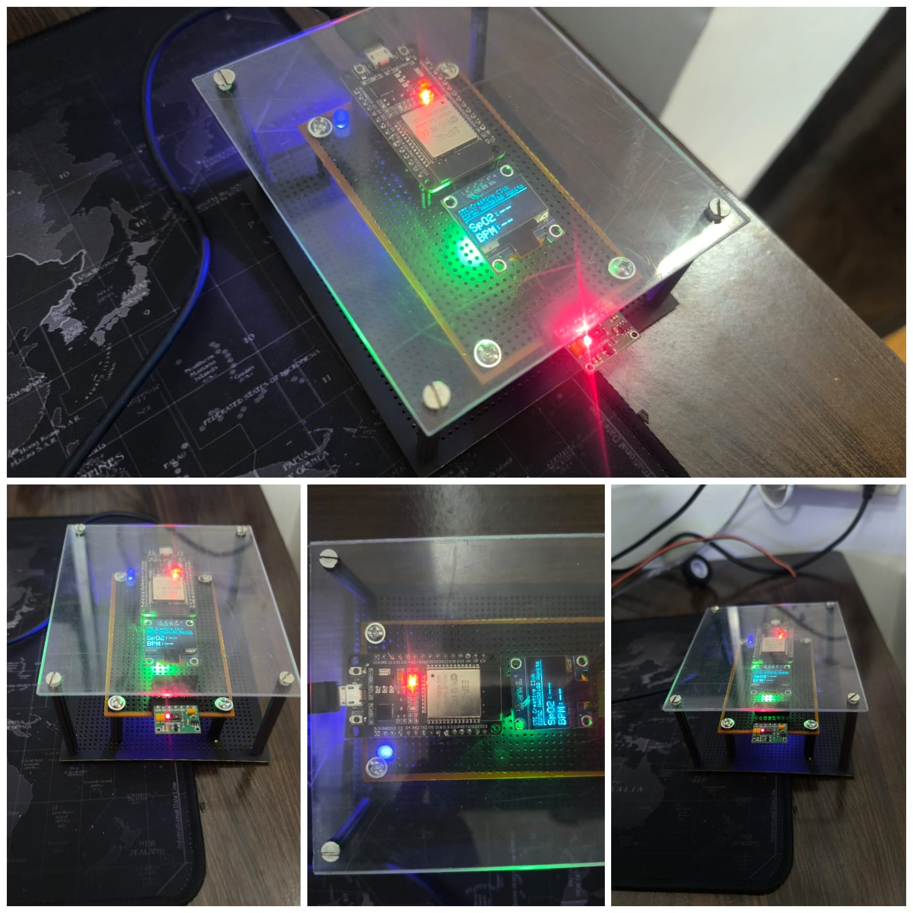

<h1 align="center">💓 ESP32 MAX30100 Web + OLED Patient Monitor 💓</h1>

  <b>A Smart Wi-Fi Based Real-Time SpO₂ & Heart Rate Monitoring System</b> 
  <em>Powered by ESP32 • Live Web Dashboard • OLED Display • Finger Detection LED</em>

---

## ✨ Overview

This project is a **fully offline, smart health monitoring system** built with:

- ⚡ **ESP32 DevKit V1**
- ❤️ **MAX30100 SpO₂ & Heart Rate Sensor**
- 🖥 **SSD1306 OLED Display (I²C)**
- 🌐 **Local Wi-Fi Dashboard @ 192.168.4.1**

ESP32 creates its own hotspot and shows live readings on mobile/PC **without internet**.

---

## 🌈 Versions (Highly Recommended)

### 🧰 ESP32 Board Version
ESP32 Arduino Core : 2.0.17

### 📚 Library Versions

| Library | Version | Emoji |
|--------|---------|-------|
| MAX30100 milan by Oxullo Intersecaris... | **1.3.0** | ❤️ |
| Adafruit SSD1306 byAdafruit6 | **2.5.15** | 🖥 |
| Adafruit GFX Library by Adafruit| **1.12.3** | 🎨 |
| Wire (built-in) | ESP32 default | ⚙ |
| Adafruit_BusIO by Adafruit   | 1.17.4  |💻|
---

## 📸 Project Photo

  

---
## 📸 Local Wi-Fi Dashboard

  

---

## 🚀 Key Features

- 🔴 **Real-time SpO₂ (%)**
- 💛 **Real-time Heart Rate (BPM)**
- 🖥 **OLED Display Output**
- 🌐 **Modern Web Dashboard**
- 💡 **Status LED (GPIO 15)**
- 📊 **Trend Chart (Pure JavaScript)**
- 📡 **Works fully offline**
- 🧪 **1 second auto-refresh**

---

## 🔧 Hardware Components

| Component | Description | Emoji |
|----------|-------------|-------|
| ESP32 DevKit V1 | MCU + Wi-Fi | ⚡ |
| MAX30100 | SpO₂ + BPM Sensor | ❤️ |
| SSD1306 OLED | 128×64 I²C Screen | 🖥 |
| LED + Resistor | Indicator | 💡 |
| USB Cable | Power | 🔌 |
| Jumper Wires | Connections | 🔧 |

---

## 🧩 Wiring Diagram

### 🔗 I²C Connections (Common for OLED + MAX30100)

| ESP32 | MAX30100 | OLED | Emoji |
|-------|-----------|-------|-------|
| 3V3   | VIN       | VCC   | 🔋 |
| GND   | GND       | GND   | ⚫ |
| GPIO 21 | SDA     | SDA   | 🔵 |
| GPIO 22 | SCL     | SCL   | 🟢 |

⚠ **Important Notes:**  
- MAX30100 runs ONLY on **3.3V**  
- Do NOT use **RD / IRD / INT** pins  

---

### 💡 LED Indicator (Validity Detection)

| ESP32 Pin | LED | Emoji |
|-----------|------|--------|
| GPIO 15 | LED + (via resistor) | 💡 |
| GND | LED – | ⚫ |

✔ LED ON = Finger detected + Valid data  
✔ LED OFF = No finger / Bad signal  

---

## 📡 Wi-Fi Access Point

SSID : STC_MAX30100_AP
PASS : 12345678
IP : 192.168.4.1

Access dashboard:  
👉 **http://192.168.4.1**

---

## 🖥 Web Dashboard (Beautiful UI)

Includes:

- 🟢 Online/Offline Status
- 🧪 Live SpO₂ %
- ❤️ Updated BPM
- 📊 Trend Chart
- 🔄 Auto-refresh every 1 second
- 🌙 Modern dark interface

No external JS libraries used — **pure HTML + CSS + JS**.

---

## 🖥 OLED Display

SpO2 : 97 %
BPM : 78
Status : OK

⏱ Updates every second.

---

## 📁 Project Structure

📦 ESP32-MAX30100-Patient-Monitor
┣ 📜 README.md
┣ 📜 ESP32_MAX30100_Web_OLED.ino
┗ 📂 images/ (optional)

---

## 🛠 Setup & Installation

### 1️⃣ Install ESP32 Board  
Arduino IDE → Boards Manager → Search **esp32** → Install **2.0.17**

### 2️⃣ Install Libraries  
Library Manager → Install:

- MAX30100_PulseOximeter → 1.2.0  
- Adafruit SSD1306 → 2.5.7  
- Adafruit GFX → 1.11.9  

### 3️⃣ Upload Code  
- Board → ESP32 Dev Module  
- Port → Select  
- ⚡ Upload the .ino file  

---

## 🔬 Testing Procedure

1. Power ON ESP32  
2. Connect mobile/PC to Wi-Fi AP  
3. Open dashboard  
4. Place finger on MAX30100  
5. LED → ON  
6. OLED + Web dashboard → Updating live  
7. Smooth graph visible  

---

## 🛠 Troubleshooting

### ❌ MAX30100 Not Detected  
✔ Must use 3.3V  
✔ Check SDA=21, SCL=22  
✔ Do not connect RD/IRD/INT  

### ❌ OLED Blank  
✔ Address must be 0x3C  
✔ Same I²C line  

### ❌ Dashboard Not Opening  
✔ Connect to STC_MAX30100_AP  
✔ Use http://192.168.4.1  
✔ Turn OFF mobile data  

### ❌ Unstable Values  
✔ Keep finger steady  
✔ Avoid bright light  

---

## 🧭 Future Enhancements (v2.0)

- 🌡 Add temperature sensor  
- 💾 Add data logging  
- 🌐 Add cloud sync  
- 🧑‍⚕ Multi-patient support  
- 🎨 Themes for dashboard  

---

## © License  
Open-source for education & personal research.

---

  Made with ❤️ by <b>STC Creative Club</b>

